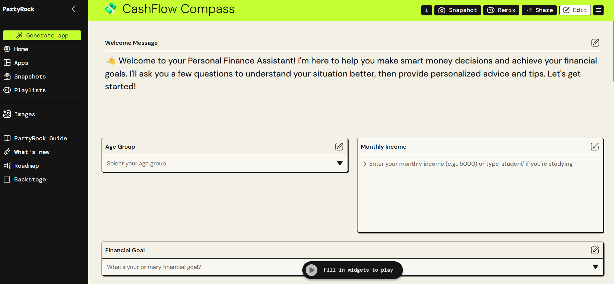

# 💸 Personal Finance Tips Assistant (Amazon PartyRock Project)

This is an AI-powered **Personal Finance Tips Assistant** created using **Amazon PartyRock**. It helps users improve their money habits by offering personalized, goal-based financial tips.

---

## 🎯 Features

- 🔍 **Goal-Based Recommendations:** Budgeting, saving, investing, and debt-reduction tips based on user input.
- 📆 **Daily Tip Generator:** Shows a new money-saving or finance tip each session.
- 🚩 **Red Flag Alerts:** Warns users about poor money habits (e.g., no emergency fund).
- 💬 **Finance Myth Buster:** Disproves common misconceptions in a fun, educational way.
- 🧠 **Money Personality Quiz:** Identifies user’s spending personality for tailored advice.

---

## 🛠️ Built With

- **Amazon PartyRock**
- Prompt Engineering
- Basic UI Customization (via PartyRock)

---

## 📹 Demo

🎥 Watch the full screen recording in the `video_demo` folder.

---

## 📬 Contact

Made by **[Your Name]**  
LinkedIn: https://linkedin.com/in/itsmemauliii
GitHub: https://github.com/itsmemauliii
